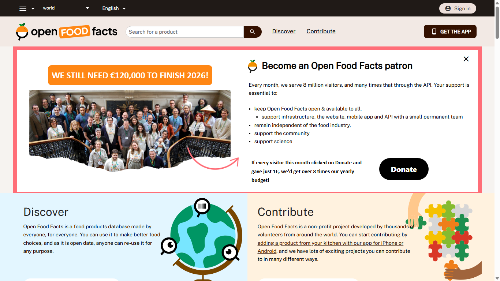
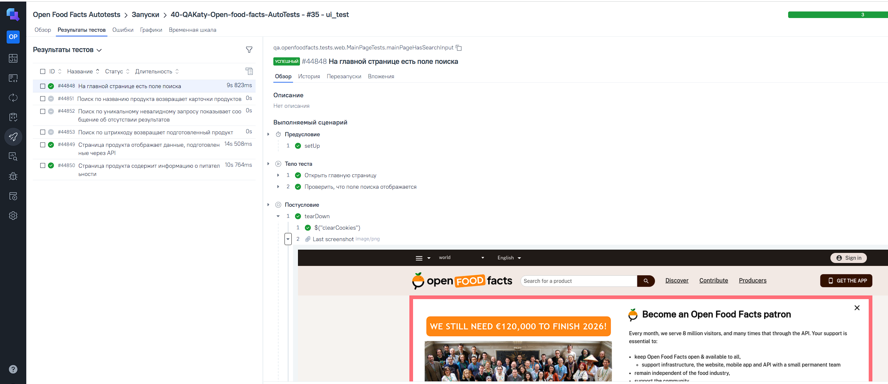
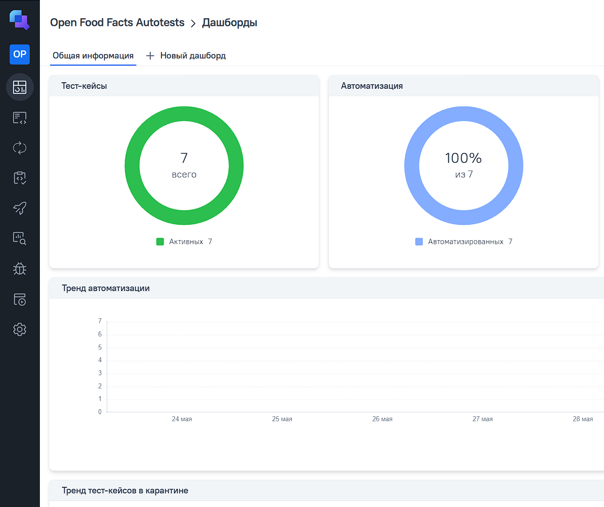
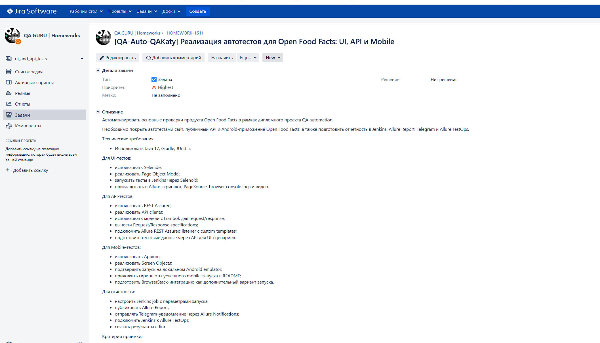
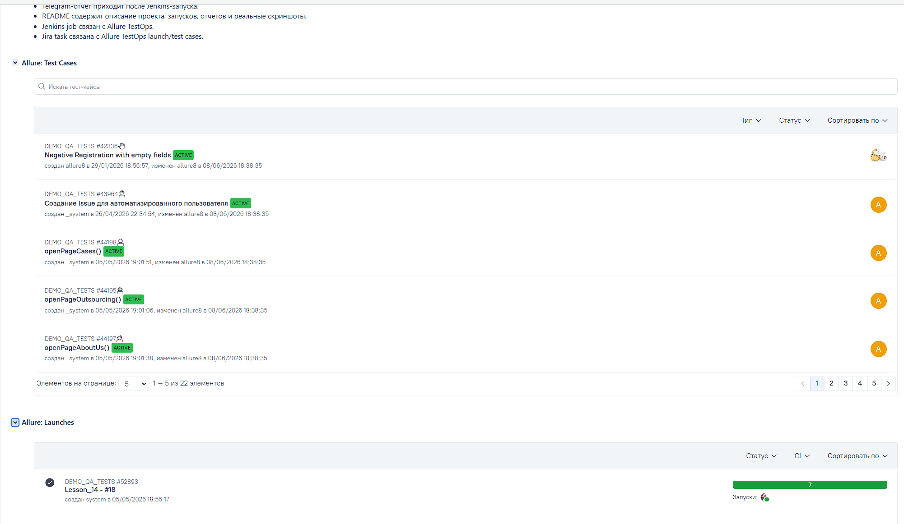
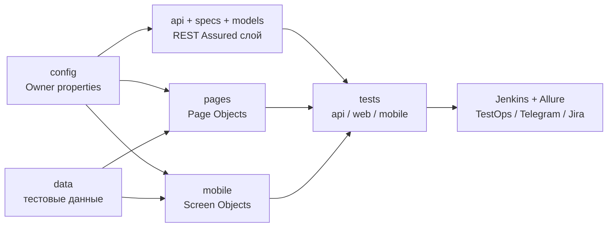

# Open Food Facts Autotests

<p align="center">
  <a href="https://world.openfoodfacts.org">world.openfoodfacts.org</a>
</p>

<p align="center">
  <a href="https://www.java.com/"></a>
  <a href="https://gradle.org/"></a>
  <a href="https://junit.org/junit5/"></a>
  <a href="https://selenide.org/"></a>
  <a href="https://rest-assured.io/"></a>
  <a href="https://appium.io/"></a>
  <a href="https://allurereport.org/"></a>
</p>

<p align="center">
  
</p>

## О проекте

Дипломный проект объединяет UI, API, Mobile и ручное тестирование одного продукта - Open Food Facts.

- UI автотесты покрывают главную страницу, поиск и карточку продукта.
- API автотесты проверяют получение продукта, поиск и подготовку данных для UI.
- Mobile автотесты проверяют основные сценарии Android приложения через Screen Objects.
- Jenkins запускает выбранный набор тестов, публикует Allure отчет, отправляет Telegram уведомление и загружает результаты в Allure TestOps.
- Jira задача диплома связана с автотестами через `@Issue("HOMEWORK-1611")`.

## Покрытие

| Блок | Реализовано |
| --- | --- |
| UI | Page Objects, Selenide, Selenoid video, скриншоты, page source, browser logs |
| API | REST Assured clients, Specs, Lombok models, custom Allure templates |
| Mobile | Appium, Screen Objects, локальный Android emulator, BrowserStack configuration |
| Manual | Ручные сценарии в [docs/manual-tests.md](docs/manual-tests.md) |
| CI/CD | Jenkins Pipeline, Allure Report, Allure TestOps, Telegram, Jira |

## Технологии

`Java 17` `Gradle` `JUnit 5` `Selenide` `REST Assured` `Appium` `Owner` `Lombok` `AssertJ` `Allure Report` `Jenkins` `Allure TestOps` `Jira` `Telegram` `Selenoid` `BrowserStack`

## Запуск тестов

```bash
gradle clean test
gradle clean api_test
gradle clean ui_test
gradle clean mobile_test
```

UI запуск с видео в Selenoid:

```bash
gradle clean ui_test \
  -DremoteUrl=https://<login>:<password>@selenoid.autotests.cloud/wd/hub \
  -Dheadless=false \
  -DenableVideo=true \
  -DvideoStorageUrl=https://selenoid.autotests.cloud/video/
```

Локальный запуск Mobile тестов:

```bash
gradle clean mobile_test \
  -DdeviceHost=emulator \
  -DlocalUrl=http://127.0.0.1:4723/wd/hub \
  -DdeviceName=Pixel_4 \
  -Dudid=emulator-5556 \
  -DplatformVersion=17 \
  -Dapp=src/test/resources/apps/openfoodfacts-fdroid.apk \
  -DnoReset=true
```

APK для локального эмулятора хранится локально и не добавляется в Git.

## Отчеты

После локального запуска:

```bash
gradle allureReport
gradle allureServe
```

В Allure прикладываются скриншоты, page source, browser logs, Selenoid video, BrowserStack video и API request/response через custom templates.

### Allure Report

<p>
  
</p>

### Telegram

<p>
  
  
</p>

### Allure TestOps

<p>
  
</p>

<p>
  
</p>

### Mobile

<p>
  
  
</p>

Mobile тесты стабильно подтверждены локальным Android эмулятором. В BrowserStack приложение Open Food Facts может зависать на onboarding из-за состояния облачного устройства, сети или ограничений учебного аккаунта; Screen Object обрабатывает системный диалог `OpenFoodFacts isn't responding` нажатием `Wait`.

### Jira

<p>
  
</p>

<p>
  
</p>

### Видео UI запуска

[Открыть видео из Allure/Selenoid](docs/assets/video/slnd.mp4)

## Jenkins и интеграции

- [Jenkinsfile](Jenkinsfile) запускает выбранный `TEST_SUITE`: `api_test`, `ui_test`, `mobile_test` или `test`.
- [notifications.json](notifications.json) используется для Telegram отчета через Allure Notifications.
- Allure TestOps получает результаты из `build/allure-results` через `withAllureUpload`.
- Настройки инфраструктуры описаны в [docs/jenkins.md](docs/jenkins.md) и [docs/testops-jira-checklist.md](docs/testops-jira-checklist.md).

Секреты не должны храниться в репозитории. Для Jenkins используются credentials `katy-telegram-bot-token`, `katy-telegram-chat-id` и `browserstack-credentials`.

## Структура



| Блок | Папки | Назначение |
| --- | --- | --- |
| API слой | `api`, `specs`, `models` | клиенты, спецификации, request/response модели |
| UI слой | `pages` | Page Objects для сайта Open Food Facts |
| Mobile слой | `mobile`, `drivers` | Screen Objects и настройка Android драйвера |
| Данные и конфигурация | `data`, `config`, `src/test/resources/config` | подготовленные продукты, Owner config, properties |
| Тесты | `tests/api`, `tests/web`, `tests/mobile` | наборы автотестов по тегам и Gradle tasks |
| Отчеты | `helpers`, `tpl`, `docs/assets` | Allure attachments, custom templates, скриншоты и видео |

<details>
<summary>Показать дерево папок</summary>

```text
src/test/java/qa/openfoodfacts
|-- api
|-- config
|-- data
|-- drivers
|-- helpers
|-- mobile
|-- models
|-- pages
|-- specs
`-- tests
    |-- api
    |-- mobile
    `-- web
```

</details>

## Полезные ссылки

- [Open Food Facts](https://world.openfoodfacts.org)
- [Open Food Facts API](https://openfoodfacts.github.io/openfoodfacts-server/api/)
- [Android приложение Open Food Facts](https://github.com/openfoodfacts/smooth-app)
- [Ручные тесты](docs/manual-tests.md)
