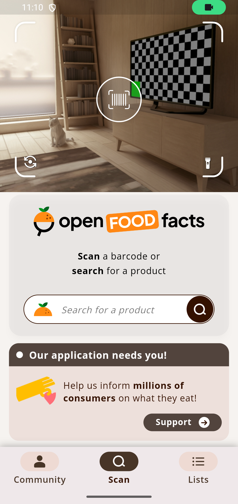
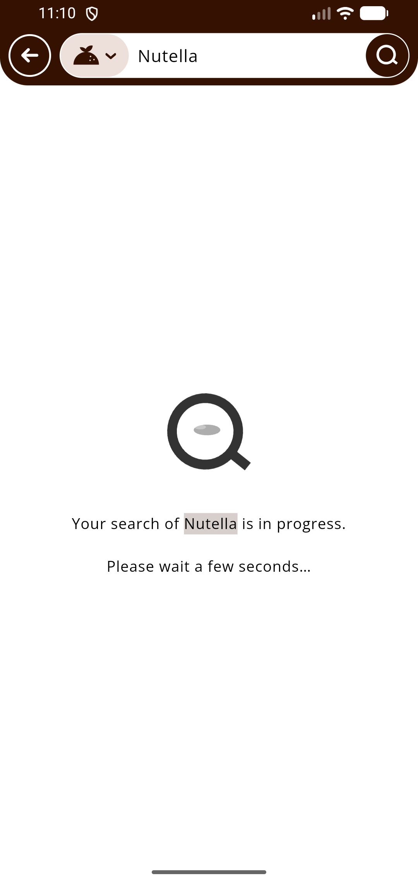

# Open Food Facts Autotests

<h3 align="center">Дипломный проект по автоматизации тестирования <a href="https://world.openfoodfacts.org">world.openfoodfacts.org</a></h3>

<p align="center">
  <a href="https://www.java.com/"></a>
  <a href="https://gradle.org/"></a>
  <a href="https://junit.org/junit5/"></a>
  <a href="https://selenide.org/"></a>
  <a href="https://rest-assured.io/"></a>
  <a href="https://appium.io/"></a>
  <a href="https://allurereport.org/"></a>
</p>

## Содержание

- [О проекте](#о-проекте)
- [Что покрыто тестами](#что-покрыто-тестами)
- [Технологии](#технологии)
- [Структура проекта](#структура-проекта)
- [Запуск тестов](#запуск-тестов)
- [Отчеты и артефакты](#отчеты-и-артефакты)
- [Jenkins, Telegram и инфраструктура](#jenkins-telegram-и-инфраструктура)
- [Ручные тесты](#ручные-тесты)
- [Полезные ссылки](#полезные-ссылки)

## О проекте

Проект объединяет основные блоки дипломной работы вокруг одного продукта - Open Food Facts:

- UI автотесты для сайта с использованием Page Objects.
- API автотесты с клиентами, моделями на Lombok, спецификациями и кастомными шаблонами Allure REST Assured.
- Подготовка тестовых данных через API для UI сценариев.
- Mobile автотесты для Android приложения с использованием Screen Objects.
- Ручные тесты и чеклисты в документации проекта.
- Запуск в Jenkins с Allure отчетом и уведомлением в Telegram.

## Что покрыто тестами

### UI

- Проверка главной страницы и поиска.
- Проверка карточки продукта: штрихкод, бренд, данные о питательной ценности.
- Проверка отображения подготовленного через API продукта в UI.
- При запуске через Selenoid в Allure прикладываются скриншот, исходный код страницы, логи консоли браузера и видео.

### API

- Получение продукта по штрихкоду.
- Проверка данных продукта: бренд и nutriments.
- Проверка поиска через Open Food Facts API.
- Подготовка данных для UI тестов.
- Заготовка теста создания продукта на тестовом стенде с авторизацией.

### Mobile

- Проверка главного экрана Android приложения.
- Проверка доступности действия сканирования.
- Проверка поиска продукта в приложении.
- При запуске в BrowserStack в Allure прикладываются скриншот, исходный код страницы и видео.

### Manual

Ручные тесты вынесены в отдельный документ: [docs/manual-tests.md](docs/manual-tests.md).

## Технологии

| Зона | Используется |
| --- | --- |
| Язык и сборка | Java 17, Gradle |
| Тестовый фреймворк | JUnit 5 |
| UI | Selenide |
| API | REST Assured, Jackson, Lombok |
| Mobile | Appium Java Client, Selenide |
| Конфигурация | Owner |
| Проверки | AssertJ |
| Отчеты | Allure Report, Allure Selenide, Allure REST Assured |
| CI и инфраструктура | Jenkins, Allure TestOps, Jira, Telegram, BrowserStack, Selenoid |

## Структура проекта

```text
src/test/java/qa/openfoodfacts
|-- api
|   |-- ApiClient.java
|   |-- AuthApiClient.java
|   |-- ProductsApiClient.java
|   `-- SearchApiClient.java
|-- config
|-- data
|-- drivers
|-- helpers
|-- mobile
|   |-- MainScreen.java
|   |-- ProductScreen.java
|   `-- SearchScreen.java
|-- models
|   |-- products
|   |-- search
|   `-- users
|-- pages
|   |-- MainPage.java
|   |-- ProductPage.java
|   `-- SearchPage.java
|-- specs
`-- tests
    |-- api
    |-- mobile
    `-- web
```

## Запуск тестов

Запуск всех немобильных тестов:

```bash
gradle clean test
```

Запуск UI тестов:

```bash
gradle clean ui_test
```

Запуск UI тестов с видео в Selenoid:

```bash
gradle clean ui_test \
  -DremoteUrl=https://<login>:<password>@selenoid.autotests.cloud/wd/hub \
  -Dheadless=false \
  -DenableVideo=true \
  -DvideoStorageUrl=https://selenoid.autotests.cloud/video/
```

Запуск API тестов:

```bash
gradle clean api_test
```

Запуск Android mobile тестов:

```bash
gradle clean mobile_test
```

Для локального эмулятора APK хранится только локально и не попадает в Git. Рекомендуемый путь:

```text
src/test/resources/apps/openfoodfacts-fdroid.apk
```

Перед стабильным запуском на локальном эмуляторе нужно один раз пройти первичную настройку приложения. В проекте используется `noReset=true`, поэтому подготовленное состояние приложения сохраняется между сессиями.

Пример запуска на локальном эмуляторе:

```bash
gradle clean mobile_test \
  -DdeviceHost=emulator \
  -DlocalUrl=http://127.0.0.1:4723/wd/hub \
  -DdeviceName=Pixel_4 \
  -Dudid=emulator-5556 \
  -DplatformVersion=17 \
  -Dapp=src/test/resources/apps/openfoodfacts-fdroid.apk \
  -DnoReset=true
```

В Jenkins запуск мобильных тестов в BrowserStack использует учетную запись `browserstack-credentials` и автоматически загружает APK по параметру `BROWSERSTACK_APP_URL`, если `BROWSERSTACK_APP` пустой.

Для BrowserStack запуска используются параметры `DEVICE_NAME=Google Pixel 7` и `PLATFORM_VERSION=13.0`. Значение `Pixel_7` подходит как имя локального эмулятора, но для BrowserStack нужно указывать публичное название устройства.

## Отчеты и артефакты

После локального запуска можно сформировать Allure отчет:

```bash
gradle allureReport
```

Открыть отчет локально:

```bash
gradle allureServe
```

В Allure прикладываются:

- скриншот;
- исходный код страницы;
- логи консоли браузера;
- видео из Selenoid для UI запусков;
- скриншот и видео из BrowserStack для мобильных запусков;
- логи API запросов и ответов через кастомные шаблоны.

### Примеры отчетов

Allure отчет после запуска тестов:


Telegram уведомление после Jenkins запуска:


Локальный запуск mobile тестов на Android эмуляторе:





## Jenkins, Telegram и инфраструктура

В проекте подготовлены:

- [Jenkinsfile](Jenkinsfile) для запуска выбранного набора тестов.
- [notifications.json](notifications.json) для отправки отчета в Telegram через Allure Notifications.
- [docs/jenkins.md](docs/jenkins.md) с настройками Jenkins, учетных записей, параметров запуска и отчетов.
- [docs/testops-jira-checklist.md](docs/testops-jira-checklist.md) с чеклистом для Allure TestOps и Jira.
- [docs/assets/screenshots](docs/assets/screenshots) для реальных скриншотов Jenkins, Allure, Telegram, TestOps и Jira.
- [docs/assets/video](docs/assets/video) для демо-видео.

Секреты не хранятся в Git. Для Jenkins используются учетные записи:

- `katy-telegram-bot-token`;
- `katy-telegram-chat-id`;
- `browserstack-credentials`.

Для UI видео в Selenoid важно запускать тесты с `HEADLESS=false`, иначе видео может содержать только стартовый экран Selenoid.

Telegram token хранится в Jenkins credentials и не должен попадать в Git или Jenkins console. Если token уже попал в открытый лог, его нужно перевыпустить в BotFather и обновить credential `katy-telegram-bot-token`.

## Ручные тесты

Ручные сценарии описаны в [docs/manual-tests.md](docs/manual-tests.md). Они покрывают сайт, API поведение и дымовые проверки Android приложения.

## Полезные ссылки

- Тестируемый продукт: [Open Food Facts](https://world.openfoodfacts.org)
- Документация API: [Open Food Facts API](https://openfoodfacts.github.io/openfoodfacts-server/api/)
- Android приложение: [openfoodfacts/smooth-app](https://github.com/openfoodfacts/smooth-app)
- Последняя проверенная Android версия: `v4.23.0`, опубликована 6 января 2026 года
